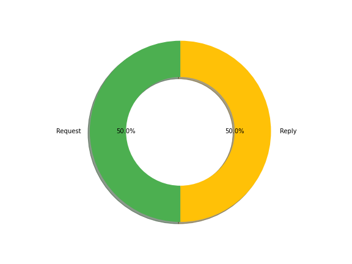

# Julien Nkoma

## Projet SAE 15

Sur cette page web, nous vous présentons les informations et données pertinentes trouvées dans le fichier à traiter.

### Nombre total de trames échangées
11016

### Drapeaux (Flags)
- Nombre de flags [P] (PUSH) : 1673
- Nombre de flags [S] (SYN) : 2046
- Nombre de flag [.] (ACK) : 6961

### Nombre de requêtes et réponses
- Request : 42
- Reply : 42

### Statistiques entre seq, win et ack
- Nombre de seq : 8201
- Nombre de win : 10766
- Nombre de ack : 8768
